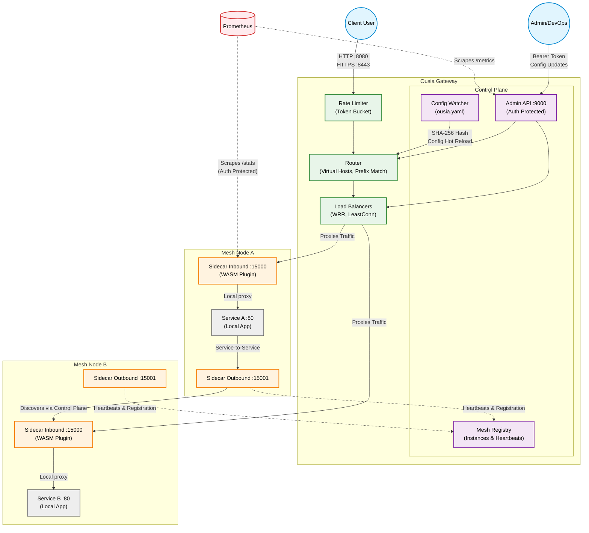

# Ousia Architecture

This diagram maps out the Ousia architecture, including the gateway, sidecars, and secured traffic flows.

### What this diagram highlights:
- **The Data Plane:** Shows how external client traffic enters the Gateway, passes through the Rate Limiter, gets routed, balanced, and forwarded to the Sidecar Inbounds (where the WASM plugin runs).
- **The Control Plane:** Visualizes the `Admin API`, `Mesh Registry`, and `Config Watcher` driving dynamic updates to the Router and Balancer.
- **Service-to-Service:** Shows how `Service A` talks to its Outbound Sidecar, which discovers the route to `Service B`'s Inbound Sidecar.
- **Security:** Explicitly calls out the Auth Protection on the Admin API and Sidecar `/stats`, as well as the WASM Plugin and SHA-256 hash checks.
